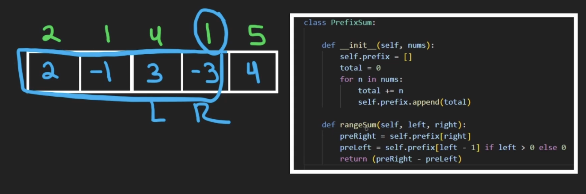

# dsa-notes
* while using two pointers (i,j) ,
  * if operation is done on ith element then increase or decrease i
  * if operation is done on jth element then increase or decrease j
	* but not both
* merge sort
  ```
  class Solution:
    def merge(self,arr,low,mid,high):
        L,R = [],[]
        n1,n2 = 0,0
        for i in range(low,mid+1):
            L.append(arr[i])
            n1+=1
        for i in range(mid,high):
            R.append(arr[i+1])
            n2+=1
        i,j,k = 0,0,low
        while i<n1 and j<n2:
            if L[i] <= R[j]:
                arr[k] = L[i]
                i+=1
            else:
                arr[k] = R[j]
                j+=1
            k+=1
        while i<n1:
            arr[k] = L[i]
            i+=1
            k+=1
        
        while j<n2:
            arr[k] = R[j]
            j+=1
            k+=1

    def ms(self,arr,low,high):
        if low<high:
            mid = (low+high)//2
            self.ms(arr,low,mid)
            self.ms(arr,mid+1,high)
            self.merge(arr,low,mid,high)

    def sortArray(self, nums) :
        self.ms(nums,0,len(nums)-1)
        return nums

	s = Solution()        
	print(s.sortArray([5,4,3,2,1]))
  ```
* merge step in merge sort , or union of two sorted arrays
```
def findUnion(self,a,b):
        # code here
        ans = []
        i,j = 0,0
        d = {}
        n1,n2 = len(a), len(b)
        while i<n1 and j<n2:
            if a[i]<=b[j]:
                if a[i] not in d:
                    d[a[i]] = 1
                    ans.append(a[i])
                i+=1
            elif a[i]>b[j]:
                if b[j] not in d:
                    d[b[j]] = 1
                    ans.append(b[j])
                j+=1
        while i<n1:
            if a[i] not in d:
                d[a[i]] = 1
                ans.append(a[i])
            i+=1
        while j<n2:
            if b[j] not in d:
                d[b[j]] = 1
                ans.append(b[j])
            j+=1
        return ans
```

* Two sum , when there are numbers that are not to be sorted:
  ```
  def twoSum(self, nums: List[int], target: int) -> List[int]:

        d = {}
        for i in range(len(nums)):
            if target - nums[i] in d:
                return sorted([i,d[target - nums[i]]])
            else:
  ```
implement hashmap basic approach
1. using arrays
   ```
   class MyHashMap:

    def __init__(self):
        self.map = [-1]*1000001
    def put(self, key: int, value: int) -> None:
        self.map[key] = value
    def get(self, key: int) -> int:
        return self.map[key]

    def remove(self, key: int) -> None:
        self.map[key] = -1
    
   ```

implement hashset basic approach
1. using arrays
   ```
	class MyHashSet:

    def __init__(self):
        self.set = [False]*1000001

    def add(self, key: int) -> None:
        if not self.set[key]:
            self.set[key] = True

    def remove(self, key: int) -> None:
        self.set[key] = False

    def contains(self, key: int) -> bool:
        return self.set[key]
   ```

* Bucket sort -  is a sorting technique that involves dividing elements into various groups, or buckets. These buckets are formed by uniformly distributing the elements. Once the elements are divided into buckets, they can be sorted using any other sorting algorithm. Finally, the sorted elements are gathered together in an ordered fashion

    * Use this when its mentioned that the elements of the array lie in some range like (0-100) and need to sort it.

    * below example is to sort array containing only 0,1 and 2s

    ```
    def sortColors(self, nums: List[int]) -> None:
        """
        Do not return anything, modify nums in-place instead.
        """
        count = [0,0,0]
        for n in nums:
            count[n]+=1
        pointer = 0
        for i in range(3):
            for j in range(count[i]):
                nums[pointer] = i
                pointer+=1
    ```
    * another example of bucket sort - top most frequent or less frequent elements. here we are creating the bucket with frequency as the key or index.so that we can iterate the frequencies.

    ```
    class Solution:
    def topKFrequent(self, nums: List[int], k: int) -> List[int]:
        d = {}
        ans = []
        l = len(nums)
        for n in nums:
            if n not in d:
                d[n] = 1
            else:
                d[n]+=1

        countDict = {}
        for key,value in d.items():
            if value not in countDict:
                countDict[value] = [key]
            else:
                countDict[value].append(key)

        for freq in range (l,0,-1):
            if freq in countDict:
                for n in countDict[freq]:
                    ans.append(n)
                    k-=1
                    if k == 0:
                        return ans
            if k == 0:
                return ans
        return ans

        
    ```

* Kadane's alg - for finding sub arrays mostly with max sum or min sum or max length or min length or any criteria given

    * basic alg - Before we add the current element, we check if the curSum is negative. If it is, we reset it to zero.
    ```
    def slidingWindow(nums):
    maxSum = nums[0]
    curSum = 0
    maxL, maxR = 0, 0
    L = 0

    for R in range(len(nums)):
        if curSum < 0:
            curSum = 0
            L = R

        curSum += nums[R]
        if curSum > maxSum:
            maxSum = curSum
            maxL, maxR = L, R 

    return [maxL, maxR]
    ```
    * ex1: Given an integer array arr, return the length of a maximum size turbulent subarray of arr. A subarray is turbulent if the comparison sign flips between each adjacent pair of elements in the subarray.

        Input: arr = [9,4,2,10,7,8,8,1,9]

        Output: 5
        
        Explanation: arr[1] > arr[2] < arr[3] > arr[4] < arr[5]

    ```
    class Solution:
    def maxTurbulenceSize(self, arr: List[int]) -> int:
        n = len(arr)
        res = cnt = 0
        sign = -1
        
        for i in range(n - 1):
            if arr[i] > arr[i + 1]:
                cnt = cnt + 1 if sign == 0 else 1
                sign = 1
            elif arr[i] < arr[i + 1]:
                cnt = cnt + 1 if sign == 1 else 1
                sign = 0
            else:
                cnt = 0
                sign = -1
                
            res = max(res, cnt)
            
        return res + 1
    ```

* Prefix sum alg - store the sum from first index to given index in new array prefix .

    * Ex1: get the subarray sum with given two indicies
    

    * 

