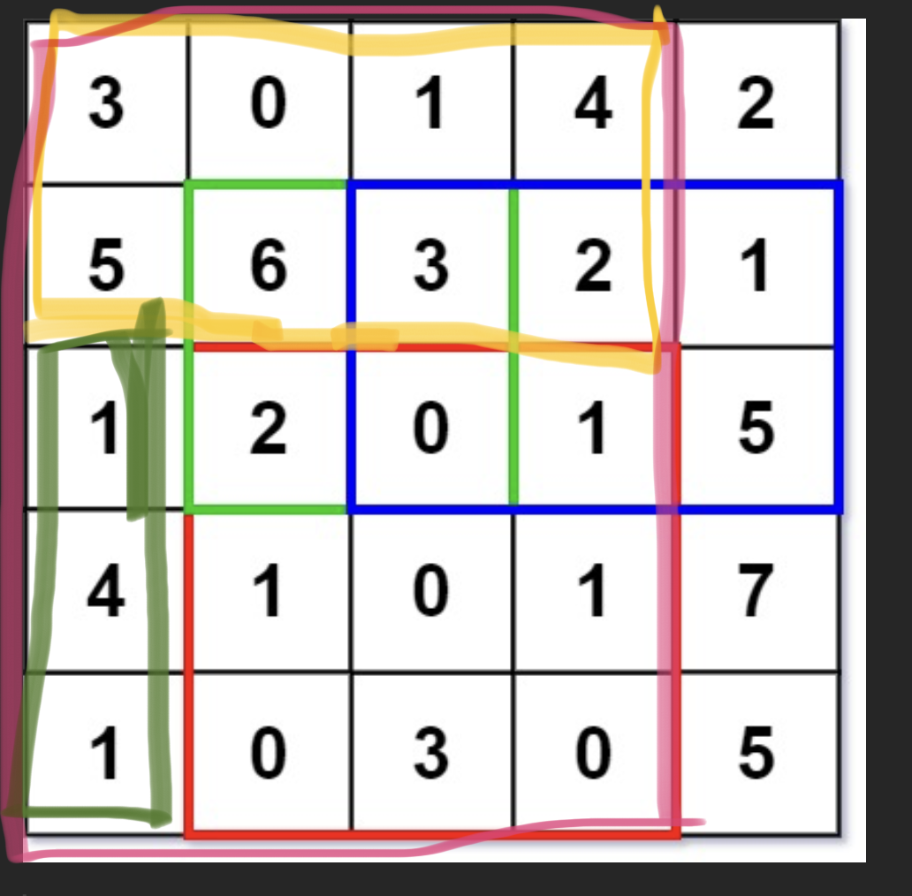

# dsa-notes
* while using two pointers (i,j) ,
  * if operation is done on ith element then increase or decrease i
  * if operation is done on jth element then increase or decrease j
	* but not both
* merge sort
  ```
  class Solution:
    def merge(self,arr,low,mid,high):
        L,R = [],[]
        n1,n2 = 0,0
        for i in range(low,mid+1):
            L.append(arr[i])
            n1+=1
        for i in range(mid,high):
            R.append(arr[i+1])
            n2+=1
        i,j,k = 0,0,low
        while i<n1 and j<n2:
            if L[i] <= R[j]:
                arr[k] = L[i]
                i+=1
            else:
                arr[k] = R[j]
                j+=1
            k+=1
        while i<n1:
            arr[k] = L[i]
            i+=1
            k+=1
        
        while j<n2:
            arr[k] = R[j]
            j+=1
            k+=1

    def ms(self,arr,low,high):
        if low<high:
            mid = (low+high)//2
            self.ms(arr,low,mid)
            self.ms(arr,mid+1,high)
            self.merge(arr,low,mid,high)

    def sortArray(self, nums) :
        self.ms(nums,0,len(nums)-1)
        return nums

	s = Solution()        
	print(s.sortArray([5,4,3,2,1]))
  ```
* merge step in merge sort , or union of two sorted arrays
```
def findUnion(self,a,b):
        # code here
        ans = []
        i,j = 0,0
        d = {}
        n1,n2 = len(a), len(b)
        while i<n1 and j<n2:
            if a[i]<=b[j]:
                if a[i] not in d:
                    d[a[i]] = 1
                    ans.append(a[i])
                i+=1
            elif a[i]>b[j]:
                if b[j] not in d:
                    d[b[j]] = 1
                    ans.append(b[j])
                j+=1
        while i<n1:
            if a[i] not in d:
                d[a[i]] = 1
                ans.append(a[i])
            i+=1
        while j<n2:
            if b[j] not in d:
                d[b[j]] = 1
                ans.append(b[j])
            j+=1
        return ans
```

* Two sum , when there are numbers that are not to be sorted:
  ```
  def twoSum(self, nums: List[int], target: int) -> List[int]:

        d = {}
        for i in range(len(nums)):
            if target - nums[i] in d:
                return sorted([i,d[target - nums[i]]])
            else:
  ```
implement hashmap basic approach
1. using arrays
   ```
   class MyHashMap:

    def __init__(self):
        self.map = [-1]*1000001
    def put(self, key: int, value: int) -> None:
        self.map[key] = value
    def get(self, key: int) -> int:
        return self.map[key]

    def remove(self, key: int) -> None:
        self.map[key] = -1
    
   ```

implement hashset basic approach
1. using arrays
   ```
	class MyHashSet:

    def __init__(self):
        self.set = [False]*1000001

    def add(self, key: int) -> None:
        if not self.set[key]:
            self.set[key] = True

    def remove(self, key: int) -> None:
        self.set[key] = False

    def contains(self, key: int) -> bool:
        return self.set[key]
   ```
* Bucket sort -  is a sorting technique that involves dividing elements into various groups, or buckets. These buckets are formed by uniformly distributing the elements. Once the elements are divided into buckets, they can be sorted using any other sorting algorithm. Finally, the sorted elements are gathered together in an ordered fashion

    * Use this when its mentioned that the elements of the array lie in some range like (0-100) and need to sort it.

    * below example is to sort array containing only 0,1 and 2s

    ```
    def sortColors(self, nums: List[int]) -> None:
        """
        Do not return anything, modify nums in-place instead.
        """
        count = [0,0,0]
        for n in nums:
            count[n]+=1
        pointer = 0
        for i in range(3):
            for j in range(count[i]):
                nums[pointer] = i
                pointer+=1
    ```
    * another example of bucket sort - top most frequent or less frequent elements. here we are creating the bucket with frequency as the key or index.so that we can iterate the frequencies.

    ```
    class Solution:
    def topKFrequent(self, nums: List[int], k: int) -> List[int]:
        d = {}
        ans = []
        l = len(nums)
        for n in nums:
            if n not in d:
                d[n] = 1
            else:
                d[n]+=1

        countDict = {}
        for key,value in d.items():
            if value not in countDict:
                countDict[value] = [key]
            else:
                countDict[value].append(key)

        for freq in range (l,0,-1):
            if freq in countDict:
                for n in countDict[freq]:
                    ans.append(n)
                    k-=1
                    if k == 0:
                        return ans
            if k == 0:
                return ans
        return ans

        
    ```

* Kadane's alg - for finding sub arrays mostly with max sum or min sum or max length or min length or any criteria given

    * basic alg - Before we add the current element, we check if the curSum is negative. If it is, we reset it to zero.
    ```
    def slidingWindow(nums):
    maxSum = nums[0]
    curSum = 0
    maxL, maxR = 0, 0
    L = 0

    for R in range(len(nums)):
        if curSum < 0:
            curSum = 0
            L = R

        curSum += nums[R]
        if curSum > maxSum:
            maxSum = curSum
            maxL, maxR = L, R 

    return [maxL, maxR]
    ```
    * ex1: Given an integer array arr, return the length of a maximum size turbulent subarray of arr. A subarray is turbulent if the comparison sign flips between each adjacent pair of elements in the subarray.

        Input: arr = [9,4,2,10,7,8,8,1,9]

        Output: 5
        
        Explanation: arr[1] > arr[2] < arr[3] > arr[4] < arr[5]

    ```
    class Solution:
    def maxTurbulenceSize(self, arr: List[int]) -> int:
        n = len(arr)
        res = cnt = 0
        sign = -1
        
        for i in range(n - 1):
            if arr[i] > arr[i + 1]:
                cnt = cnt + 1 if sign == 0 else 1
                sign = 1
            elif arr[i] < arr[i + 1]:
                cnt = cnt + 1 if sign == 1 else 1
                sign = 0
            else:
                cnt = 0
                sign = -1
                
            res = max(res, cnt)
            
        return res + 1
    ```

* Prefix sum alg - store the sum from first index to given index in new array prefix .

    * Ex1: get the subarray sum with given two indicies
    

    * Ex2: Given a 2D matrix matrix, Calculate the sum of the elements of matrix inside the rectangle defined by its upper left corner (row1, col1) and lower right corner (row2, col2).

    * The idea here is to calculate the sum of red box:
        1. Calculate sum of pink box
        2. Subtract sum of yellow box
        3. Subtract sum of green box
        4. Add the column sum above green box (since its already subtracted) which is 3,5
    

    ```
    class NumMatrix:

    def __init__(self, matrix: List[List[int]]):
        self.prefix = []
        for i in range(len(matrix)):
            prefixSum = 0
            row = []
            if i == 0:
                for j in range(len(matrix[i])):
                    prefixSum += matrix[i][j]
                    row.append(prefixSum)
            else:
                for j in range(len(matrix[i])):
                    prefixSum += matrix[i][j]
                    row.append(prefixSum + self.prefix[i-1][j])
            self.prefix.append(row)

    def sumRegion(self, row1: int, col1: int, row2: int, col2: int) -> int:

        if row1 == 0 and col1 != 0:
            return (self.prefix[row2][col2]) - (self.prefix[row2][col1-1])

        elif row1 != 0 and col1 == 0:
            return (self.prefix[row2][col2]-self.prefix[row1-1][col2])

        elif row1 == 0 and col1 == 0:
            return self.prefix[row2][col2]

        else:
            return (self.prefix[row2][col2] - self.prefix[row1-1][col2]) - (self.prefix[row2][col1-1] - self.prefix[row1-1][col1-1])
    ```

    * Ex3: Product of array elements except itself 

    * Naive approach time complexity - O(n^2) and should be done without using divison operator

    * Using prefix and suffix products - O(n)

    ```
    class Solution:
    def productExceptSelf(self, nums: List[int]) -> List[int]:
        l = len(nums)
        prefix = []
        suffix = [0]*l
        prod = 1
        for n in nums:
            prod *= n
            prefix.append(prod)

        prod = 1
        for i in range(l-1,-1,-1):
            prod *= nums[i]
            suffix[i] = prod

        for i in range(l):
            if i == 0:
                prod = suffix[i+1]
            elif i == l-1:
                prod = prefix[i-1]
            else:
                prod = prefix[i-1]*suffix[i+1]
            nums[i] = prod
        return nums
    ```

    * Ex-4 : Given Given an array of integers nums and an integer k, return the total number of subarrays whose sum equals to k.

        Brute force: Find all the subarrays and calculate their sums to check for equals to k. O(n^2)

        Optimal : Using prefix sum and hash maps.

        Intution: 
        
        If there is an array , whose prefix sum till index i from 0 is S . We need to find the subarray in this array whose sum equals k and ends with index i. So excluding subarray , with prefixsum equals S-k will give subarray with sum k. For every k , there is exists equivalent S-k i.e.. if there are two subarrys with sum k then there will be two subarrys with sum S-k  in the same array. Finding S-k is more convenient then finding k , because S-k is the prefix sum.Maintain a hashmap with each prefix and their respective counts that has occured in the array.
        

        Solution: https://leetcode.com/problems/subarray-sum-equals-k/description/ 
* Prob - Determine if a 9 x 9 Sudoku board is valid. Only the filled cells need to be validated according to the following rules:

    Each row must contain the digits 1-9 without repetition.
Each column must contain the digits 1-9 without repetition.
Each of the nine 3 x 3 sub-boxes of the grid must contain the digits 1-9 without repetition.
Note:

    A Sudoku board (partially filled) could be valid but is not necessarily solvable.
Only the filled cells need to be validated according to the mentioned rules.

    Approach - create a 3 different dictionaries for row, cols and boxs. each key in the dictionaries is another dictionary to check the value exists or not.
https://leetcode.com/problems/valid-sudoku/description/

* Prob - Given an unsorted array of integers nums, return the length of the longest consecutive elements sequence.

    You must write an algorithm that runs in O(n) time.

    Approach - identify the start of a sequence? For example, in [1, 2, 3, 10, 11, 12], only 1 and 10 are the beginning of a sequence. Instead of trying to form a sequence for every number, we should only consider numbers like 1 and 10.We iterate through the array and only start building the sequence if it is the start of a sequence. This avoids repeated work. We can use a hash set for O(1) lookups by converting the array to a hash set.https://leetcode.com/problems/longest-consecutive-sequence/description/

* Two pointers alg -
  * One diff b/w two pointers alg and sliding window technique is in two pointers we care about only the two elements the indicies are pointing to , but in sliding window we care about the subarray between these two indicies.
  * 


