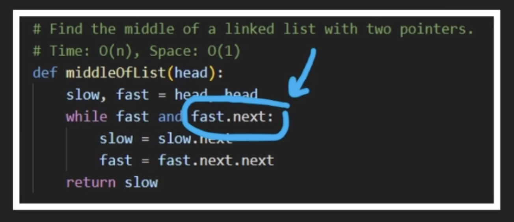

* while working with linked list , make sure u dont loose refernce to any node , by assigning pointers.

* Reverse singly linked list
https://leetcode.com/problems/reverse-linked-list/description/


Iterative
```
class Solution:
    def reverseList(self, head: Optional[ListNode]) -> Optional[ListNode]:

        curr = head
        prev = None
        while curr != None:
            temp = curr.next
            curr.next = prev
            prev = curr
            curr = temp
        
        return prev
```

Recursion
```
class Solution:
    def reverseList(self, head: Optional[ListNode]) -> Optional[ListNode]:

        if head == None:
            return None
        
        newHead = head

        if head.next:
            newHead = self.reverseList(head.next)
            head.next.next = head
        head.next = None

        return newHead
```

* Fast and slow pointers: It is an algorithimic technique where there are two pointers fast and slow . Fast traverses at a time two steps ahead , while slow is normally one step ahead.

Ex-1: Find middle of linked list



Ex-2: Check linked list has cycle or not -> fast and slow pointers will always overlap , if there is a cycle.


Ex-3: Check linked list has cycle or not. If it does , return the head of the cycle start.

Intution: After detecting the cycle , start 2ns slow pointer from linked list head and itertate both 1st and 2nd slow pointers. The intution is that , they will always overlap at the start of the cycle.


