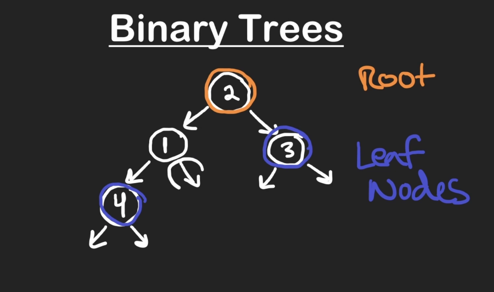
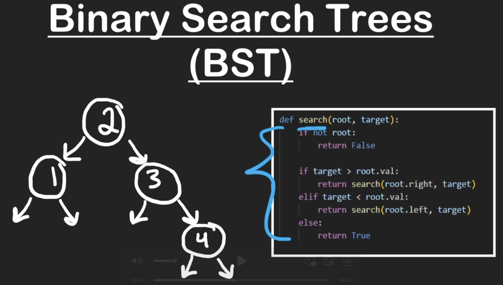
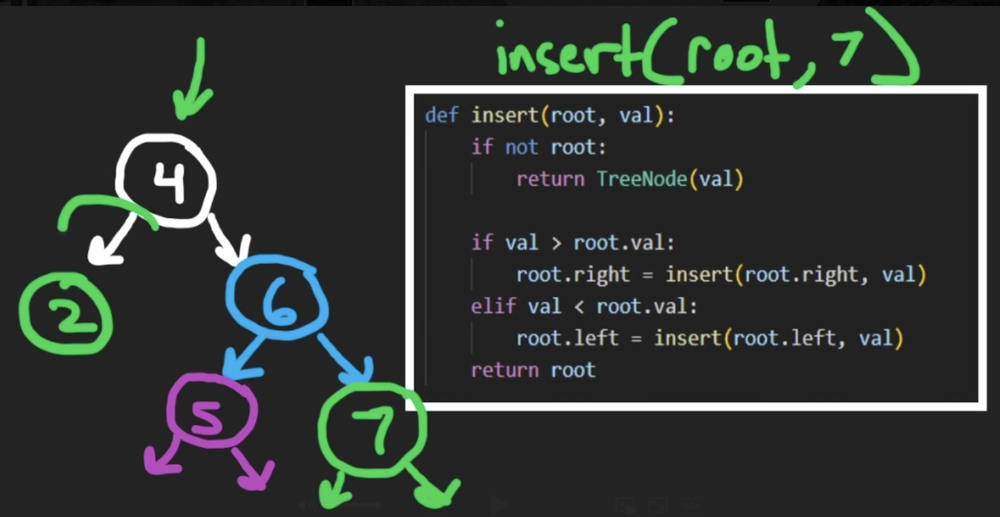
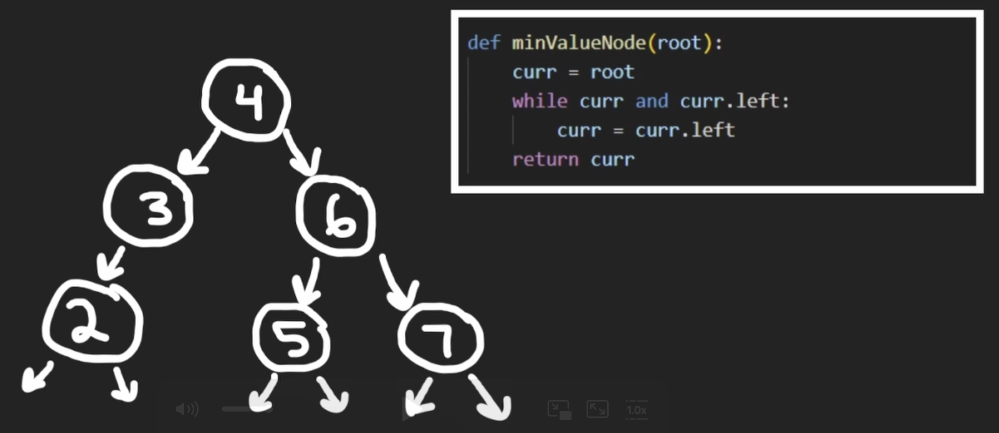
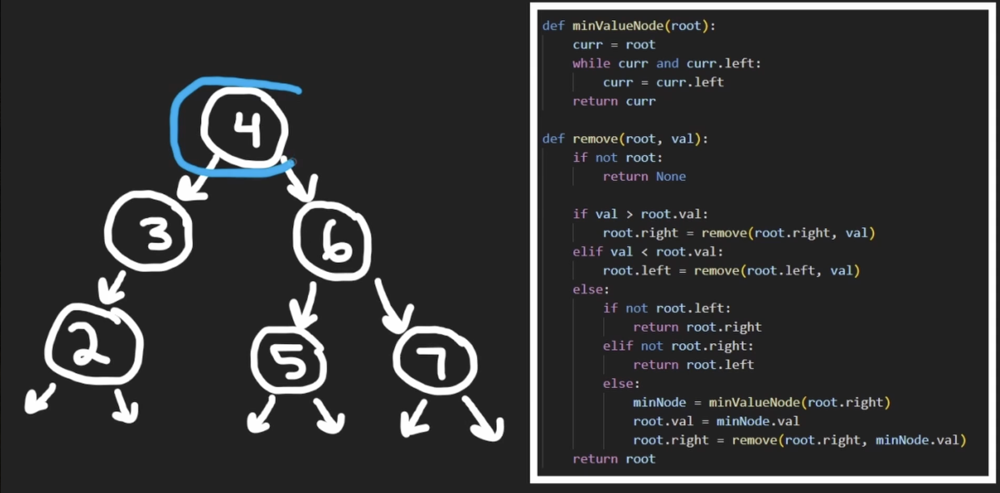

* Binary trees dont have cycles in them
* In Binary tree , descendant of node means , any node/s that come beneath the given node.(childs)

* Similarly , ancestor of node means , any node/s that come above the given node.(parents)

* Depth of a node , is the no.of nodes(length) from given node to highest ancestor.

* Search for a value in binary search tree(recursive)

* if the bst is balanced (diff between the heights of each subtrees of node is no more than 1) then time complexity is O(logn) orelse around O(h) h-> height

* Purpose of bst :

    insertion and deletion of el in sorted list - O(n)

    insertion and deletion of el in bst - O(logn)

* Insert a node in bst

* Finding the min val in a bst - The min val in a bst is going to be the left most leaf node.

* Removing a node in bst 

    case1: when the removable node has 1 child nodes , then simply connect the non- null node to the parent node of the removable node

    case2: when the removable node has 0 child nodes , then simply connect the null to the parent node of the removable node

    case3: when the removable node has 2 child nodes , then find the min node in right subtree of the removable node (or max node in left subtree of the removable node) and replace that value with the removable node value. next repeat the process for root of the right sub tree.

    
